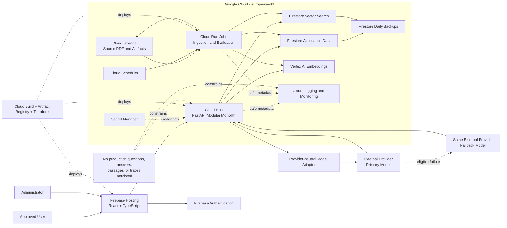

# Gate 2 - Architecture Design

**Status:** FINAL  
**Version:** 1.1
**Date:** 2026-10-05  
**Input reference:** DMBOK Compass — Business Requirements Document, Version 0.1  
**Author:** Software Architect Agent

## 1. Executive Summary

DMBOK Compass will be a small, access-controlled retrieval-augmented generation application hosted primarily on Google Cloud. A React and TypeScript browser application will call a Python FastAPI modular monolith on Cloud Run, with Firebase Authentication enforcing verified identity and administrator approval. Firestore Native mode will hold application records, versioned evaluation data, corpus chunks, and a 768-dimensional native vector index; production interaction content will remain ephemeral. Vertex AI will generate corpus and query embeddings, while primary and fallback answer models will use the approved Google Gemini API through a provider-neutral adapter. Offline Cloud Run Jobs will ingest the searchable DMBOK PDF and preserve page and chapter or section provenance. The design favors managed, scale-to-zero services to support no more than 10 approved users, three concurrent users, a 100-request default daily cap, and a €5 monthly GCP infrastructure limit. Release remains blocked until provider availability, budget, quality, latency, and privacy gates and the sponsor’s accepted publisher-rights decision are evidenced.

## 2. Business Context & Drivers

DMBOK Compass replaces manual searching of *DAMA-DMBOK, Second Edition* with evidence-backed lookup, comparison, synthesis, study support, and scenario guidance. The sponsor, product owner, administrator, evaluator, corpus owner, support owner, and release approver are currently the same person. Other actors are registration applicants, approved users, and the hosted answer-model provider.

In scope are public registration requests, verified email and password authentication, administrator approval, a responsive English browser interface, corpus-only answers, page and section citations, request-scoped retrieval traces, configurable quotas, aggregate administration, offline ingestion of one searchable PDF, versioned evaluation, daily backup, and documented recovery. The first release excludes anonymous access, more than 10 approved users, multiple corpora, saved conversations, feedback, MFA, native mobile applications, an admin PDF-upload interface, contractual uptime, and high-availability infrastructure.

The principal drivers are grounding and citation quality, reproducible release decisions, strict non-retention of production interactions, cost control, and maintainability by one sponsor. The most significant external constraints are publisher rights, external-provider data terms and free-tier capacity, reliable extraction of citation provenance, and the absence of an existing codebase. The repository is therefore treated as greenfield, with the approved BRD and source PDF as the only reusable initiative assets.

## 3. Requirements Traceability

| Req ID | Requirement | Design decision | Component(s) | Reused/New |
|--------|-------------|-----------------|--------------|------------|
| BPR-001 | Registration and approval | Firebase handles registration and verification; backend approval state gates answering. | Firebase Authentication; Backend API; Web Application | Reused + New |
| BPR-002 | Grounded question answering | Retrieval-first pipeline permits answer, qualified answer, or refusal and validates citations. | Backend API; Firestore Data and Vector Store; External Model Adapter | New + Reused |
| BPR-003 | Corpus maintenance | Administrator-only, idempotent Cloud Run Job rebuilds a staged corpus version from Cloud Storage. | Corpus Ingestion and Evaluation Worker; Cloud Storage; Vertex AI; Firestore | New + Reused |
| BPR-004 | Pre-release evaluation | Versioned evaluation runs report every release metric and block promotion on failure. | Corpus Ingestion and Evaluation Worker; Backend API; Firestore | New + Reused |
| BPR-005 | Release decision | Sponsor approval is persisted against immutable configuration and evaluation identifiers. | Backend API; Firestore; Web Application | New + Reused |
| BPR-006 | Backup and recovery | Daily Firestore backups retain no more than 30 copies; corpus index is reproducible from source. | Firestore; Cloud Storage; Operations and Delivery Platform | Reused |
| FR-001 | Submit registration request | Firebase sign-up plus a pending Firestore profile records email and username after validation. | Web Application; Firebase Authentication; Backend API; Firestore | New + Reused |
| FR-002 | Verify submitted email | Firebase email verification is mandatory before approval. | Firebase Authentication; Backend API | Reused + New |
| FR-003 | Approve, reject, or deactivate users | Administrator endpoints and UI update authorization state immediately. | Web Application; Backend API; Firestore | New + Reused |
| FR-004 | Maximum 10 approved users | Approval uses a Firestore transaction that rejects an eleventh active user. | Backend API; Firestore | New + Reused |
| FR-005 | Sign-in, sign-out, and password reset | Firebase Authentication provides credential and recovery flows; backend checks approval on every request. | Firebase Authentication; Web Application; Backend API | Reused + New |
| FR-006 | Submit an English DMBOK question | Responsive chat UI sends an authenticated request and presents processing, result, or operational error. | Web Application; Backend API | New |
| FR-007 | Corpus-only answers | Prompt contract prohibits external knowledge; evidence and claim checks enforce grounding. | Backend API; External Model Adapter; Firestore | New + Reused |
| FR-008 | Required question categories | Versioned evaluation dataset covers definitions, explanations, comparisons, study, and scenarios. | Corpus Ingestion and Evaluation Worker; Firestore | New + Reused |
| FR-009 | Label supported synthesis | Response schema marks synthesis and maps material claims to retrieved citations. | Backend API; External Model Adapter; Web Application | New |
| FR-010 | Page, section, and excerpt citations | Immutable chunk provenance is rendered by the application, not invented by the model. | Firestore; Backend API; Web Application | Reused + New |
| FR-011 | Strong, partial, and absent evidence outcomes | Retrieval thresholds and response policy select normal, qualified, or refusal behavior. | Backend API; External Model Adapter | New |
| FR-012 | Request-scoped retrieval trace | API returns retrieved passages, available scores, model, and timing in the live response only. | Backend API; Web Application | New |
| FR-013 | No retained interaction content | Questions, retrieved passages, answers, and traces stay in request memory and are excluded from storage and logs. | Backend API; Operations and Delivery Platform | New + Reused |
| FR-014 | Automatic fallback model | Provider adapter routes eligible primary-model failures to a second model from the same provider. | External Model Adapter; External Hosted Answer Models | New + Reused |
| FR-015 | Configurable per-user daily limit, default 100 | Firestore transactions enforce per-user counters and administrator-editable configuration. | Backend API; Firestore; Web Application | New + Reused |
| FR-016 | Configurable global daily limit | A transactional global counter defaults to 100 requests per UTC day and is editable without deployment. | Backend API; Firestore; Web Application | New + Reused |
| FR-017 | Explain quota block and reset | API returns the applicable limit and UTC reset time without exposing other users. | Backend API; Web Application | New |
| FR-018 | Anonymous aggregate administration | Content-free counters, provider failures, and cost indicators feed the admin view. | Backend API; Web Application; Firestore; Operations and Delivery Platform | New + Reused |
| FR-019 | Run full or subset evaluation | Administrator starts a uniquely identified evaluation job for selected dataset items. | Web Application; Backend API; Corpus Ingestion and Evaluation Worker | New |
| FR-020 | Calculate all release metrics | Evaluation worker reports numerator, denominator, percentage, threshold, and pass/fail for each gate. | Corpus Ingestion and Evaluation Worker; Firestore | New + Reused |
| FR-021 | Generated annotations and human-approved gold subset | Evaluation entities preserve generated candidates, review status, rubric, passages, and dataset version. | Corpus Ingestion and Evaluation Worker; Firestore; Web Application | New + Reused |
| FR-022 | Persist reproducible evaluation evidence | Non-user evaluation questions, annotations, configurations, aggregate results, and decisions are versioned in Firestore and source control as appropriate. | Firestore; Corpus Ingestion and Evaluation Worker; Operations and Delivery Platform | Reused + New |
| NFR-001 | 95% within 15 seconds | Stage budgets, bounded model timeouts, scale settings, and performance gates enforce the target. | Backend API; External Model Adapter; Operations and Delivery Platform | New + Reused |
| NFR-002 | Three simultaneous users | Cloud Run starts at concurrency 8, maximum two instances, and is load-tested with three users. | Operations and Delivery Platform; Backend API | Reused + New |
| NFR-003 | No more than €5 monthly infrastructure | Scale-to-zero managed services, quotas, budgets, and free-tier answer models minimize and cap usage. | Operations and Delivery Platform; Backend API | Reused + New |
| NFR-004 | HTTPS for protected traffic | Firebase Hosting, Cloud Run, Firebase Auth, and provider APIs use HTTPS only. | Operations and Delivery Platform; Firebase Authentication; External Hosted Answer Models | Reused |
| NFR-005 | Safe password storage | Firebase Authentication owns salted password hashing; passwords never enter application storage or logs. | Firebase Authentication | Reused |
| NFR-006 | Login throttling and secure reset | Firebase Authentication supplies throttling and expiring recovery flows; tests verify behavior. | Firebase Authentication | Reused |
| NFR-007 | Current desktop and mobile browsers | Responsive React UI receives automated viewport and browser-flow testing. | Web Application | New |
| NFR-008 | Basic WCAG 2.1 AA | Semantic UI, keyboard operation, focus management, contrast, and automated/manual checks are release gates. | Web Application | New |
| NFR-009 | Daily backups, maximum 30 copies | Firestore managed backup schedule and retention are infrastructure-as-code controls. | Firestore; Operations and Delivery Platform | Reused |
| NFR-010 | Restore within 24 hours | Restore runbook, periodic exercise, versioned source PDF, and deterministic rebuild meet recovery target. | Firestore; Cloud Storage; Corpus Ingestion and Evaluation Worker | Reused + New |
| NFR-011 | Ephemeral interactions excluded from persistence | Allowlisted telemetry and storage tests prove production request content is absent. | Backend API; Operations and Delivery Platform | New + Reused |
| NFR-012 | Reproducible evaluation | Reports bind dataset, corpus, retrieval, prompt, provider, model, and scorer versions. | Corpus Ingestion and Evaluation Worker; Firestore | New + Reused |
| NFR-013 | Best-effort availability and clear failures | Bounded retries, fallback, circuit breaking, and honest operational errors avoid ungrounded output. | Backend API; External Model Adapter; Web Application | New |
| NFR-014 | User isolation and admin authorization | Role checks are enforced server-side and covered by negative authorization tests. | Backend API; Firebase Authentication; Firestore | New + Reused |
| INT-01 | Primary and fallback hosted answer models | Provider-neutral adapter calls two models from the same external provider; exact provider is a release-gated assumption. | External Model Adapter; External Hosted Answer Models | New + Reused |
| INT-02 | Embedding service | Vertex AI `gemini-embedding-001` produces 768-dimensional document and query embeddings. | Vertex AI Embedding Service | Reused |
| INT-03 | Email verification and recovery delivery | Firebase Authentication provides managed verification and reset email workflows. | Firebase Authentication | Reused |
| CON-01 | GCP-first hosting | All application hosting, storage, identity, ingestion, observability, and delivery use GCP/Firebase except answer generation. | Operations and Delivery Platform; all managed stores | Reused |
| CON-02 | Python backend and TypeScript frontend | FastAPI/Pydantic and React/Vite/TypeScript are the implementation standards. | Backend API; Web Application | New |
| CON-03 | Firestore application and vector data | Firestore Native mode consolidates application records and native vector search. | Firestore Data and Vector Store | Reused |
| CON-04 | One searchable DMBOK PDF | Ingestion accepts one versioned source corpus and rejects unapproved source types. | Cloud Storage; Corpus Ingestion and Evaluation Worker | Reused + New |
| CON-05 | Maximum 10 approved users | Transactional approval ceiling and tests prevent excess activation. | Backend API; Firestore | New + Reused |
| CON-06 | No saved production conversations | No chat-history entity or analytics payload is designed. | Backend API; Firestore; Operations and Delivery Platform | New + Reused |
| CON-07 | No fixed deadline; readiness-gated release | Delivery follows evidence and approval gates rather than calendar release. | Operations and Delivery Platform; evaluation workflow | Reused + New |

## 4. Architecture Overview

At context level, applicants and approved users interact only with the browser application; the administrator additionally manages users, quotas, corpus maintenance, evaluations, and release decisions. The GCP-hosted system integrates with Firebase Authentication, Vertex AI embeddings, and one external answer-model provider. At container level, a Firebase-hosted web application calls a Cloud Run FastAPI modular monolith. The API owns authorization, quotas, retrieval orchestration, response policy, citations, administration, and evaluation control. Firestore holds durable application and corpus-vector data, Cloud Storage holds source and versioned ingestion artifacts, and Cloud Run Jobs perform corpus ingestion and evaluation. Production interaction content exists only within request memory and the live browser response.



## 5. Component Design

### 5.1 Web Application

- **Purpose and responsibilities:** Registration, email-verification guidance, sign-in and recovery, question entry, processing and error states, answer rendering, confidence and synthesis labels, citations, request-scoped trace, quota messages, and administrator screens.
- **Classification:** **New.** The repository contains no existing interface to extend; a product-specific UI is required for the BRD workflows.
- **Interfaces and data owned:** Calls Firebase Authentication and the backend HTTPS API. It owns no durable authoritative data and stores no conversation history.
- **Technology:** React, Vite, and TypeScript on Firebase Hosting provide a small static SPA, responsive delivery, preview channels, and low operating cost without unnecessary SSR infrastructure.

### 5.2 Backend API

- **Purpose and responsibilities:** FastAPI modular monolith for token validation, approval and role authorization, registration profiles, transactional quotas, retrieval orchestration, evidence classification, citation validation, request-scoped traces, administration, aggregate reporting, evaluation control, and release decisions.
- **Classification:** **New.** No existing backend exists; one deployable application is sufficient for the low scale and avoids microservice operational overhead.
- **Interfaces and data owned:** HTTPS JSON API; Firebase token verification; Firestore and Storage clients; Vertex embedding client; external model adapter. Owns application rules but not passwords or answer-model implementation.
- **Technology:** Python, FastAPI, and Pydantic on Cloud Run support typed contracts, AI ecosystem integration, scale to zero, and straightforward testing.

### 5.3 Corpus Ingestion and Evaluation Worker

- **Purpose and responsibilities:** Administrator-triggered PDF extraction, page and section recovery, deterministic chunking, embeddings, staged vector indexing, corpus validation, full/subset evaluation, metric calculation, and promotion eligibility.
- **Classification:** **New.** The BRD requires initiative-specific provenance and evaluation behavior unavailable in the empty repository.
- **Interfaces and data owned:** Reads source and manifests from Cloud Storage; calls Vertex AI and, during evaluation, the backend/model interface; writes immutable corpus versions, chunks, annotations, and evaluation results to Firestore.
- **Technology:** Python Cloud Run Jobs invoked manually or by authenticated Cloud Scheduler. Deterministic identifiers and idempotent writes make retries safe.

### 5.4 External Model Adapter

- **Purpose and responsibilities:** Stable internal generation contract; provider-specific authentication, payload mapping, timeouts, normalized errors, primary/fallback routing, token and cost metadata, and privacy-safe handling.
- **Classification:** **New.** Provider coupling remains isolated in one adapter so the approved Google Gemini API can be replaced without changing application contracts.
- **Interfaces and data owned:** Accepts ephemeral prompt, retrieved passages, output schema, and timeout; returns answer candidates and non-content operational metadata. Owns no persistent data.
- **Technology:** A small Python protocol and one Google Gemini API adapter. The fallback is `gemini-2.5-flash` behind primary `gemini-2.5-flash-lite` for the first release.

### 5.5 Firebase Authentication

- **Purpose and responsibilities:** Email/password identity, verification email, sign-in, sign-out, secure password reset, token issuance, password hashing, and managed authentication throttling.
- **Classification:** **Reused.** Managed Firebase capability satisfies identity requirements more safely and cheaply than building credential storage.
- **Interfaces and data owned:** Browser SDK and backend token verification. Owns credentials and identity-provider state; approval, role, and quotas remain in Firestore.
- **Technology:** Firebase Authentication with email/password and email verification.

### 5.6 Firestore Data and Vector Store

- **Purpose and responsibilities:** Durable application records, transactional user ceiling and quotas, configuration, aggregate usage, active-corpus pointer, immutable chunk metadata, 768-dimensional vectors, evaluation datasets/results, release decisions, and daily backups.
- **Classification:** **Reused.** Firestore Native mode consolidates low-volume document data and native vector search, avoiding a separate database and vector service.
- **Interfaces and data owned:** Backend and worker service accounts only; no direct browser data access. Owns all durable application entities except identity credentials and source files.
- **Technology:** Firestore Native mode with vector indexes, transactions, composite indexes as needed, and managed backups.

### 5.7 Cloud Storage Corpus Repository

- **Purpose and responsibilities:** Versioned source PDF, extraction manifests, reproducible intermediate artifacts, and index-rebuild inputs.
- **Classification:** **Reused.** Managed object storage is the simplest durable source-of-truth for binary corpus files and versioned artifacts.
- **Interfaces and data owned:** Administrator maintenance process and ingestion worker. Owns source binaries and generated non-interaction artifacts.
- **Technology:** Regional Cloud Storage bucket with uniform access, object versioning where useful, encryption by default, and lifecycle rules.

### 5.8 Vertex AI Embedding Service

- **Purpose and responsibilities:** Generate matching document and query embeddings for ingestion and live retrieval.
- **Classification:** **Reused.** A managed GCP embedding service meets the GCP-first constraint and avoids hosting an embedding model.
- **Interfaces and data owned:** Backend and worker call `gemini-embedding-001` with `RETRIEVAL_QUERY` or `RETRIEVAL_DOCUMENT` and output dimensionality 768. The service owns no application records.
- **Technology:** Vertex AI through the Google Gen AI client library using workload identity.

### 5.9 External Hosted Answer Models

- **Purpose and responsibilities:** Generate structured, corpus-grounded answer candidates from supplied ephemeral evidence; provide primary and fallback model capacity.
- **Classification:** **Reused.** Hosted inference is required by the BRD and budget; self-hosting is disproportionate. Google Gemini API is selected, with paid-tier production use and release-gated model/budget validation.
- **Interfaces and data owned:** HTTPS provider API accessed only through the adapter. Data treatment must meet sponsor-approved no-training/minimal-retention terms; the application does not authorize provider-side persistence.
- **Technology:** One external provider with two configured models for the first release.

### 5.10 Google Cloud Operations and Delivery Platform

- **Purpose and responsibilities:** Static hosting, serverless runtime, scheduling, secret delivery, builds, artifact storage, infrastructure-as-code deployment, content-free logs/metrics, alerts, budgets, and rollback.
- **Classification:** **Reused.** Firebase Hosting, Cloud Run, Cloud Scheduler, Secret Manager, Cloud Build, Artifact Registry, Cloud Logging, and Cloud Monitoring provide managed capabilities at the required scale.
- **Interfaces and data owned:** CI/CD interacts with source control and Terraform; runtime emits allowlisted metadata only. Secret Manager owns provider credentials; Artifact Registry owns immutable images.
- **Technology:** GCP managed services, Terraform, Cloud Build, and one production project in `europe-west1`, with local emulators and preview revisions instead of a persistent staging environment.

## 6. Reuse Inventory

| Existing asset | Used for | Why it fits |
|----------------|----------|-------------|
| Approved BRD v0.1 | Requirements baseline, release gates, scope, and risks | It is the sole approved source of business requirements. |
| Searchable DMBOK PDF | Authoritative corpus and rebuild source | The product is explicitly limited to this edition and source. |
| Firebase Authentication | Identity, verification, recovery, and password security | It meets required flows without custom credential handling. |
| Firebase Hosting | SPA hosting and preview channels | Global static delivery and low operating overhead fit the scale. |
| Cloud Run services and jobs | API and bounded batch execution | Scale-to-zero services meet cost and operational constraints. |
| Firestore Native mode | Application records, transactions, vector search, and backups | One managed store avoids Cloud SQL and a separate vector database. |
| Cloud Storage | Source corpus and reproducible artifacts | Durable object storage fits PDF and manifest retention. |
| Vertex AI embeddings | Document and query vector generation | Managed GCP inference satisfies the GCP-first decision. |
| Secret Manager | Provider credential storage | Prevents browser, source-control, and image exposure. |
| Cloud Build and Artifact Registry | Immutable build and image supply chain | Managed CI and regional artifact storage reduce operations. |
| Cloud Logging and Monitoring | Safe aggregate telemetry and alerts | Managed operations support the single administrator when content is excluded. |

No application source code, reusable modules, deployment configuration, or existing services were found in the repository. Every new application component in section 5 is therefore justified as greenfield work.

## 7. Data Architecture

The durable domain consists of `UserProfile`, `ApprovalState`, `Role`, `QuotaPolicy`, daily `UserQuotaCounter`, daily `GlobalQuotaCounter`, `ApplicationConfiguration`, `CorpusVersion`, `DocumentChunk`, `EvaluationDataset`, `EvaluationItem`, `GoldAnnotation`, `EvaluationRun`, `ReleaseDecision`, and content-free `AggregateMetric`. Firebase Authentication separately owns credentials and identity-provider records. Cloud Storage owns the source PDF and versioned ingestion artifacts.

Each `DocumentChunk` uses a deterministic identifier derived from corpus version and source position and contains text, 768-dimensional embedding, document version, page, chapter or section, chunk ordinal, and content hash. New corpus versions are written as inactive, validated, evaluated, and activated by a single transactional pointer. The previous valid version remains available for rollback. Query embeddings use the same model, dimensionality, and distance configuration as document embeddings.

Production questions, prompts, retrieved passages, generated answers, and request traces exist only in Cloud Run memory and the live HTTPS response. They are never written to Firestore, Cloud Storage, logs, analytics, traces, backups, or build artifacts. The request response contains the answer, evidence outcome, synthesis marker, citations, retrieved passages and available scores, selected model, and timing; the browser discards this state when the request/session lifecycle ends.

Evaluation questions are a separate, non-user dataset required by FR-021 and FR-022. They may be persisted with generated and approved annotations, rubrics, expected passages, review state, and version identifiers. Reports bind dataset, corpus, retrieval, embedding, prompt, provider, primary/fallback model, scorer, and application versions. Human-reviewed gold results and automated results are reported separately.

Firestore application and vector data is backed up daily with at most 30 retained copies. A restore exercise must recover accounts, configuration, aggregate usage, and evaluation records within 24 hours. The corpus index may instead be deterministically rebuilt from Cloud Storage. Account and evaluation retention is sponsor-controlled; safe operational metadata is provisionally retained for 30 days. Secrets remain in Secret Manager and secret values do not enter Terraform state.

## 8. Interfaces & Integrations

The browser uses Firebase Authentication for registration, email verification, sign-in, sign-out, and password recovery. It calls the backend through same-origin Firebase Hosting routing to `/api/**`, sending a Firebase identity token. The infrastructure endpoint may accept requests at the Cloud Run edge, but every protected operation requires application-level token, approval, and role validation.

The backend API exposes logical contracts for registration status, current user, question answering, quota status, user administration, configuration, aggregate metrics, evaluation initiation/status, evaluation reports, and release decisions. The answer response is a typed JSON contract containing outcome (`answer`, `qualified`, or `refusal`), answer text, synthesis flag, citations, ephemeral trace, quota status, and safe operational error information. Exact URI design is an implementation contract to be frozen before frontend and backend work proceed in parallel.

The backend and worker call Vertex AI for embeddings using workload identity. Ingestion sends document chunks with the document retrieval task type; live retrieval sends only the question for query embedding. Firestore nearest-neighbor search filters on the active corpus version, retrieves an initial candidate set, and supplies the best five evidence passages after deterministic filtering or scoring.

The external model adapter sends the minimum ephemeral prompt and passages over HTTPS. It validates structured output, normalizes errors, applies bounded timeouts, and invokes fallback only for configured model-level unavailability, timeout, capacity, or rate-limit conditions. Authentication or policy failures are not blindly retried. Since both models use one provider, provider-wide failure produces a clear service error rather than an unsupported answer.

Cloud Scheduler invokes Cloud Run Jobs using a dedicated authenticated service account. Secret Manager supplies provider credentials only to the backend and evaluation job. Cloud Build produces immutable frontend and container artifacts; Artifact Registry stores images by digest; Terraform defines infrastructure and IAM. No interface permits browser access to Firestore vectors, source files, service credentials, evaluation internals, or other users' records.

## 9. Cross-Cutting Concerns

**Security and privacy.** HTTPS is mandatory. Firebase owns passwords and reset tokens. The backend performs server-side approval, role, and ownership checks on every protected operation. Separate least-privilege service accounts are used for API, worker, scheduler, and build. Firestore browser access is default-deny. Secret values are never in source control, frontend bundles, images, Terraform state, or logs. Structured telemetry uses an allowlist of request count, outcome, duration, provider/model identifier, token estimate, quota utilization, corpus/configuration versions, and error class; user-generated text is forbidden. Users receive a warning not to submit confidential or personal information.

**Performance and scalability.** NFR-001 is tested at three concurrent users. Initial Cloud Run settings are zero minimum instances, two maximum instances, concurrency eight, one vCPU, and 512 MiB. Target stage budgets are 0.5 seconds for auth/quota, 2 seconds for query embedding, 1.5 seconds for retrieval/prompt construction, 8 seconds for primary generation, up to 4 seconds for conditional fallback, and 1 second for assembly. Because fallback follows primary failure, the fallback path can exceed 15 seconds and must be measured separately; 95% of the representative normal mix must still meet the end-to-end target.

**Retrieval and answer quality.** Document/query task types and 768 dimensions are fixed per corpus version. Initial chunks are approximately 500–800 tokens with 10–15% overlap while respecting page and section boundaries. The system retrieves more candidates than it presents and evaluates the top five against the gold subset. Citations can reference only supplied chunks and are rendered from stored provenance. Low evidence produces qualification; no relevant evidence produces refusal. Corpus and application release are blocked unless SM-01 through SM-06 pass or the sponsor records an approved threshold change and exception.

**Reliability and recovery.** Availability is best effort. Retries with exponential backoff and jitter apply only to idempotent reads, embedding, indexing, and deterministic writes. User POST requests are not automatically retried. An accepted question consumes quota even if a downstream dependency fails, which bounds abuse and spend. A circuit breaker avoids repeated calls to a failing model. Application rollback uses Cloud Run revisions and Firebase releases; corpus rollback changes the active-version pointer; data-loss recovery uses Firestore backups. Restore and index-rebuild procedures must be tested within the 24-hour objective.

**Observability and operations.** Dashboards show content-free request volume, latency by stage, error classes, fallback rate, quota use, estimated provider usage, infrastructure indicators, ingestion status, active corpus/configuration versions, and evaluation results. Alerts cover repeated failures, approaching quota, latency regression, ingestion/backup failure, retrieval below 90%, and forecast cost above €5. Ephemeral interaction data limits retrospective diagnosis by design; issues are reproduced with explicit evaluation questions rather than recovered from user history.

**Cost and sustainability.** Scale-to-zero compute, one Firestore database, native vector search, lifecycle-managed object storage, and no always-on staging environment minimize idle consumption. Quotas are enforced before billable AI operations. The sponsor reviews billing monthly, and production remains within €5 of GCP infrastructure charges unless an exception is approved. External answer models use the approved paid tier and must remain within a separately sponsor-approved provider budget.

**Accessibility and user experience.** Core registration, authentication, question, citation, quota, and administration flows support current desktop/mobile viewports, keyboard navigation, visible focus, semantic labels, status announcements, and sufficient contrast. Automated accessibility checks and manual keyboard review are release gates. Operational errors never imply that an ungrounded answer was produced.

**Deployment and supply chain.** Terraform is the infrastructure source of truth. Pull requests run Python/TypeScript quality checks, contract tests, privacy tests, retrieval/citation evaluations where fixtures are available, Terraform validation, and dependency/container scanning. Main builds produce immutable artifacts. Production deployment first creates a zero-traffic Cloud Run revision and Firebase preview; promotion uses the exact tested artifact. Infrastructure plans are reviewed before apply, and API enablement or IAM mutation requires explicit authorization.

## 10. Alternatives Considered & Trade-offs

| Option | Pros | Cons | Decision | Driver |
|--------|------|------|----------|--------|
| Modular monolith on Cloud Run | Simple deployment, clear internal modules, scale to zero | Modules share one release and failure boundary | Selected | Greenfield scope, three users, €5 constraint |
| Microservices or GKE | Independent scaling and deployment | Disproportionate cost and operations | Rejected | No scale or team need justifies complexity |
| Firestore native vector search | One managed store, transactions, low operations | Less specialized than dedicated vector platforms | Selected | Low corpus/user scale and cost-first design |
| Cloud SQL with pgvector | Familiar relational model and rich SQL | Always-on cost and database administration | Rejected | Exceeds current need and budget risk |
| Vertex AI Vector Search | Strong dedicated vector scaling | Extra service, cost, and operational complexity | Rejected | Corpus size and traffic do not require it |
| React/Vite SPA on Firebase Hosting | Small static artifact, preview channels, low cost | No server-side rendering | Selected | Authenticated tool does not require SEO or SSR |
| Next.js/SSR | Server rendering and integrated routes | Additional runtime and complexity | Rejected | No stated business requirement |
| Google Gemini API for both answer models | One adapter and approved paid-tier no-training terms | Provider-wide outages and paid usage affect both models | Selected | Provider decision record; sponsor approval |
| Vertex AI Gemini as fallback | GCP-aligned provider diversity | Contradicts approved all-external answer-model decision | Rejected | Sponsor selected external fallback |
| Same provider for primary and fallback | One credential and adapter; model-level resilience | No provider-level resilience | Selected as assumption | Sponsor confirmed “same for now” |
| Custom authentication | Full control | Password, email, throttling, and recovery risk | Rejected | Firebase provides safer managed capability |
| Firebase Authentication | Managed security and email flows | Platform dependency; MFA remains out of scope | Selected | Functional and cost fit |
| Persist production questions for diagnosis | Better retrospective debugging | Violates FR-013 and NFR-011 | Rejected | Privacy requirement |
| Persist evaluator-authored questions | Enables reproducible release gates | Requires clear separation from user interactions | Selected | FR-021 and FR-022 explicitly require it |
| Minimum Cloud Run instance of one | Lower cold-start latency | Recurring idle cost threatens €5 target | Rejected initially | Cost takes precedence; performance is tested |
| One production project plus local/preview validation | Low cost and adequate release controls | Less isolation than permanent staging | Selected | Small learning service and cost constraint |
| Multi-region/high-availability deployment | Better infrastructure resilience | Higher cost and complexity | Rejected | Best-effort availability is accepted |
| Proceed without publisher permission | Allows project to continue | High-severity legal and release risk remains | Sponsor accepted, with release warning | Explicit BRD decision |

## 11. Assumptions

1. **A-01 — Greenfield repository.** No reusable application code or infrastructure exists. **Owner:** solution design. **Validation:** repository inspection completed; revisit if external assets are supplied.
2. **A-02 — GCP placement.** One production GCP project uses `europe-west1`; local emulators and preview revisions replace permanent staging. **Owner:** sponsor. **Validation:** confirm project and immutable Firestore location before provisioning.
3. **A-03 — External answer provider.** Google Gemini API provides primary `gemini-2.5-flash-lite` and fallback `gemini-2.5-flash` through the provider-neutral adapter. **Owner:** sponsor. **Validation:** revalidate model availability and provider evaluation before production release.
4. **A-04 — Provider privacy terms.** Production uses the paid Gemini API tier, with provider logs configured to the documented seven-day minimum and application interactions remaining ephemeral. **Owner:** sponsor. **Validation:** retain [provider decision evidence](decisions/provider.md) and verify terms before release.
5. **A-05 — Quota defaults.** Per-user and global limits both initially default to 100 accepted requests per UTC day and remain administrator-configurable. **Owner:** sponsor. **Validation:** confirm in acceptance testing and cost baseline.
6. **A-06 — Cost boundary.** GCP infrastructure must remain at or below €5 monthly, and external answer models must remain within a separately sponsor-approved paid-provider budget. **Owner:** sponsor. **Validation:** pre-release forecast, configured hard cap, and monthly review.
7. **A-07 — Corpus extractability.** The searchable PDF provides enough structure to recover accurate page and chapter or section provenance. **Owner:** corpus owner. **Validation:** ingestion spike and human-reviewed gold subset.
8. **A-08 — Evaluation coverage.** The sponsor supplies approximately 200 representative questions and defines a balanced distribution before baseline; 30–50 are human-approved gold items. **Owner:** sponsor/evaluator. **Validation:** dataset review and version approval.
9. **A-09 — Evaluation versus interaction data.** The non-retention rule applies to production user interactions, while evaluator-authored questions and annotations persist because FR-021/FR-022 require reproducibility. **Owner:** sponsor. **Validation:** privacy model and storage tests.
10. **A-10 — Publisher rights.** The sponsor continues without written permission and owns the release-risk decision; architecture approval is not legal clearance. **Owner:** sponsor. **Validation:** reconsider permission or obtain qualified advice before multi-user release.
11. **A-11 — Deferred runtime validation.** Terraform, application code, live provider tests, restore exercises, and performance tests do not yet exist and are mandatory implementation gates. **Owner:** orchestrator/implementation team. **Validation:** attach evidence before release.
12. **A-12 — Operational metadata retention.** Content-free logs and metrics are retained for 30 days unless the sponsor approves another bounded period. **Owner:** administrator. **Validation:** infrastructure policy and privacy inspection.
13. **A-13 — Managed email delivery.** Firebase Authentication’s managed verification and reset email flow is acceptable for the first release. **Owner:** sponsor. **Validation:** end-to-end email-flow test before onboarding users.

## 12. Risks & Mitigations

| Risk | Impact | Likelihood | Mitigation |
|------|--------|------------|------------|
| Publisher restrictions may prohibit ingestion, embeddings, provider transmission, or excerpts | High; may prevent lawful multi-user release | High | Seek written permission and qualified legal advice; keep corpus/access narrow; sponsor records final release decision. |
| External answer provider or models change | High; integration, latency, quality, and cost can regress | Medium | Stable adapter; pin model IDs and repeat provider evaluation before release. |
| Provider may retain or train on prompts and excerpts | High privacy and contractual exposure | Medium/High | Require reviewed no-training/minimal-retention terms, minimize context, warn users, and block release without approval. |
| Both answer models share one provider | Provider-wide outage defeats fallback | Medium | Honest error response, bounded circuit breaker, best-effort SLA; revisit provider diversity after first release. |
| Free tiers or service terms may change | Cost or availability can exceed constraints | High | Configurable quotas, spend monitoring, model configuration outside code, and release/operation exception process. |
| €5 budget may conflict with performance or usage | Requests may be throttled or latency target missed | Medium | Scale to zero, cap instances and daily requests, benchmark cost per answer, lower limits before exceeding budget. |
| PDF extraction may mislabel pages or sections | Incorrect citations undermine core value | High | Deterministic ingestion, provenance validation, gold-subset review, and 95% citation gate. |
| Generated evaluation annotations may reinforce system errors | False confidence and unsafe release | High | Human-review 30–50 gold items and separate gold from automated metrics. |
| No MFA increases administrator takeover risk | Unauthorized access or configuration change | Medium | Strong password flow, throttling, secure recovery, least privilege, and immediate deactivation; accepted first-release risk. |
| Ephemeral interactions reduce incident evidence | Harder retrospective diagnosis | Medium | Safe aggregate metadata, request-scoped trace, reproducible evaluation questions, and deterministic configuration versions. |
| One person owns all operational roles | Delayed response and weak segregation of duties | Medium | Document runbooks, automate gates, preserve immutable evidence, backups, and rollback procedures. |
| Firestore hot quota document becomes a bottleneck | Quota failures or request rejection | Low at three users | Transactional counter is adequate at current scale; measure contention and shard only if requirements grow. |
| Cold starts threaten the 15-second objective | User-visible latency regression | Medium | Small image, optimized startup, bounded dependencies, performance testing; consider one minimum instance only with approved cost. |

## 13. Notes for the Orchestrator

Create atomic implementation issues in this dependency order:

1. **Foundation and contracts (M):** repository layout, shared API schemas, configuration model, privacy-safe logging contract, Terraform skeleton, and CI baseline.
2. **Identity and access (M):** Firebase setup, registration profile, verification/approval/deactivation, roles, 10-user transaction, recovery flows, and authorization tests. Depends on 1.
3. **Application data and quotas (M):** Firestore schema, indexes, security posture, per-user/global UTC counters, admin configuration, and aggregate metrics. Depends on 1–2.
4. **Corpus storage and ingestion spike (L):** Cloud Storage, PDF extraction, provenance validation, chunk strategy, deterministic IDs, Vertex embeddings, staged corpus versions, and rebuild runbook. Depends on 1 and infrastructure foundation.
5. **Retrieval service (M):** query embeddings, active-version filtering, Firestore vector search, candidate selection, evidence thresholds, and top-five benchmark harness. Depends on 3–4.
6. **External model adapter (M):** provider-neutral protocol, Google Gemini primary/fallback routing, structured output, timeouts, circuit breaker, safe usage metadata, and provider contract tests. Can begin with a fake adapter after 1; live credentials and traffic remain release-gated.
7. **Grounded answering pipeline (L):** quota reservation, retrieval, prompt policy, answer/qualified/refusal outcomes, synthesis labels, citation validation, ephemeral trace, and privacy tests. Depends on 3, 5, and 6.
8. **User web experience (M):** responsive auth and chat workflows, answer/citation/trace rendering, quotas, errors, privacy warning, and WCAG checks. Depends on frozen contracts from 1 and backend capabilities from 2 and 7.
9. **Administration (M):** pending/approved users, limits, anonymous aggregates, corpus/evaluation status, and release decision UI. Depends on 2–4.
10. **Evaluation pipeline (L):** dataset and gold-annotation model, full/subset jobs, all six quality/performance metrics, version binding, reports, and sponsor approval gate. Depends on 4–7 and 9.
11. **Operations and recovery (M):** content-free dashboards/alerts, Secret Manager, backups, restore test, scheduler authentication, cost controls, and rollback runbooks. Depends on infrastructure and data components.
12. **Delivery and release validation (L):** immutable builds, Artifact Registry, preview/zero-traffic deployments, Terraform plan review, security/privacy/accessibility/load tests, provider evaluation, and final evidence bundle. Depends on all prior issues.

Freeze the API response schema, Firestore entity ownership, vector dimensionality, corpus-version contract, and privacy logging allowlist before parallel implementation. Do not create a real-provider issue as unblocked until the sponsor selects the provider and approves its terms. Do not mark release complete until publisher-risk acceptance, provider terms, retrieval/grounding/citation/answer/refusal thresholds, 15-second performance, three-user concurrency, €5 forecast, daily backup, and 24-hour restore evidence are recorded.

## 14. Machine-Readable Handoff

```yaml
status: READY_FOR_ORCHESTRATION
open_questions: 0
assumptions_count: 13
components:
  - name: Web Application
    kind: new
  - name: Backend API
    kind: new
  - name: Corpus Ingestion and Evaluation Worker
    kind: new
  - name: External Model Adapter
    kind: new
  - name: Firebase Authentication
    kind: reused
  - name: Firestore Data and Vector Store
    kind: reused
  - name: Cloud Storage Corpus Repository
    kind: reused
  - name: Vertex AI Embedding Service
    kind: reused
  - name: External Hosted Answer Models
    kind: reused
  - name: Google Cloud Operations and Delivery Platform
    kind: reused
new_components:
  - Web Application
  - Backend API
  - Corpus Ingestion and Evaluation Worker
  - External Model Adapter
reused_components:
  - Firebase Authentication
  - Firestore Data and Vector Store
  - Cloud Storage Corpus Repository
  - Vertex AI Embedding Service
  - External Hosted Answer Models
  - Google Cloud Operations and Delivery Platform
blocking_risks:
  - Publisher-rights clearance remains unresolved for multi-user release
  - Paid-tier provider budget, live model availability, and runtime provider evaluation remain release gates
```
