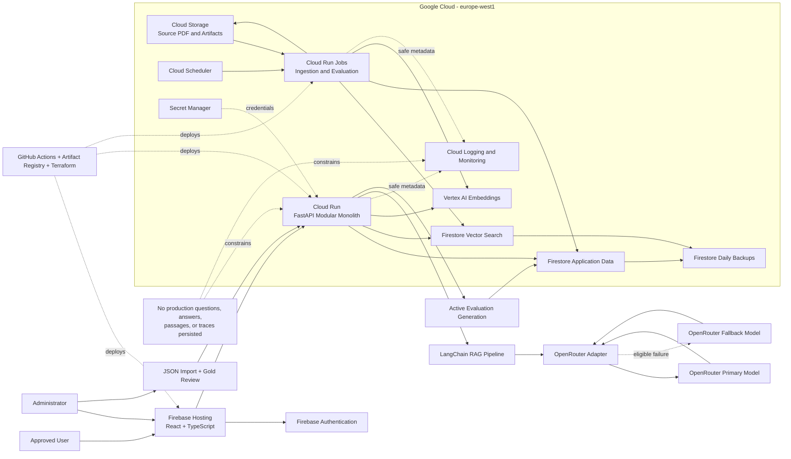

# Gate 2 - Architecture Design

**Status:** FINAL  
**Version:** 1.5
**Date:** 2026-10-10
**Input reference:** DMBOK Compass — Business Requirements Document, Version 0.1  
**Author:** Software Architect Agent

## 1. Executive Summary

DMBOK Compass is a small, access-controlled retrieval-augmented generation application hosted primarily on Google Cloud. Its React and TypeScript browser application calls a Python FastAPI modular monolith on Cloud Run, with Firebase Authentication enforcing verified identity and administrator approval. Firestore Native mode holds application records, evaluation data, corpus chunks, and a 768-dimensional native vector index; production interaction content remains ephemeral. LangChain composes retrieval and answer generation through an OpenRouter adapter; Vertex AI generates corpus and query embeddings. Administrators import JSON evaluation datasets, review gold annotations, and run exploratory or release-eligible evaluations. A successful import atomically activates the new dataset and supersedes the prior evaluation history as release evidence. Cloud Run Jobs ingest the searchable DMBOK PDF and run evaluations. Release depends on the 30–50 approved gold-item gate, provider and cost terms, quality and latency evidence, and the sponsor’s publisher-rights decision.

## 2. Business Context & Drivers

DMBOK Compass replaces manual searching of *DAMA-DMBOK, Second Edition* with evidence-backed lookup, comparison, synthesis, study support, and scenario guidance. The sponsor, product owner, administrator, evaluator, corpus owner, support owner, and release approver are currently the same person. Other actors are registration applicants, approved users, and the hosted answer-model provider.

In scope are public registration requests, verified email and password authentication, administrator approval, a responsive English browser interface, corpus-only answers, page and section citations, request-scoped retrieval traces, configurable quotas, aggregate administration, offline ingestion of one searchable PDF, administrator JSON evaluation import, record-level validation, gold-annotation review, exploratory and release-eligible evaluation, daily backup, and documented recovery. The first release excludes anonymous access, more than 10 approved users, multiple corpora, saved conversations, feedback, MFA, native mobile applications, an admin PDF-upload interface, contractual uptime, and high-availability infrastructure.

The principal drivers are grounding and citation quality, reproducible release decisions, strict non-retention of production interactions, cost control, and maintainability by one sponsor. The most significant external constraints are publisher rights, OpenRouter and upstream data terms and capacity, and reliable extraction of citation provenance. The repository now contains a FastAPI backend, evaluation contracts and in-memory reference stores, an OpenRouter adapter, Terraform, and a provider decision; these are reused as the implementation baseline, with durable import and run storage still to build.

## 3. Requirements Traceability

| Req ID | Requirement | Design decision | Component(s) | Reused/New |
|--------|-------------|-----------------|--------------|------------|
| BPR-001 | Registration and approval | Firebase handles registration and verification; backend approval state gates answering. | Firebase Authentication; Backend API; Web Application | Reused + New |
| BPR-002 | Grounded question answering | LangChain-based retrieval/generation pipeline permits answer, qualified answer, or refusal and validates citations. | Backend API; LangChain RAG Pipeline; Firestore Data and Vector Store; External Model Adapter | New + Reused |
| BPR-003 | Corpus maintenance | Administrator-only, idempotent Cloud Run Job rebuilds a staged corpus version from Cloud Storage. | Corpus Ingestion and Evaluation Worker; Cloud Storage; Vertex AI; Firestore | New + Reused |
| BPR-004 | Pre-release evaluation | Versioned evaluation runs report every release metric and block promotion on failure. | Corpus Ingestion and Evaluation Worker; Backend API; Firestore | New + Reused |
| BPR-005 | Release decision | Sponsor approval is persisted against immutable configuration and evaluation identifiers. | Backend API; Firestore; Web Application | New + Reused |
| BPR-006 | Backup and recovery | Daily Firestore backups retain no more than 30 copies; corpus index is reproducible from source. | Firestore; Cloud Storage; Operations and Delivery Platform | Reused |
| BPR-007 | Evaluation dataset import and replacement | Admin import validates per record, stages valid items, atomically switches the active dataset, then permits exploratory runs and gold review. | Web Application; Backend API; Corpus Ingestion and Evaluation Worker; Firestore | New + Reused |
| SM-01–SM-05 | Retrieval, grounding, citation, answer, and refusal gates | Active-dataset gold evaluation reports each metric against its approved threshold. | Corpus Ingestion and Evaluation Worker; Backend API; Firestore | New + Reused |
| SM-06 | At least 95% within 15 seconds | Measure complete responses under three-user normal load. | Backend API; Operations and Delivery Platform | New + Reused |
| SM-07 | Approved-user ceiling | Transactional approval enforces 10 active users. | Backend API; Firestore | New + Reused |
| SM-08 | GCP and provider cost | Track €5 monthly GCP infrastructure and separately capped OpenRouter usage, including configured fallback. | Operations and Delivery Platform; External Model Adapter | Reused + New |
| FR-001 | Submit registration request | Firebase sign-up plus a pending Firestore profile records email and username after validation. | Web Application; Firebase Authentication; Backend API; Firestore | New + Reused |
| FR-002 | Verify submitted email | Firebase email verification is mandatory before approval. | Firebase Authentication; Backend API | Reused + New |
| FR-003 | Approve, reject, or deactivate users | Administrator endpoints and UI update authorization state immediately. | Web Application; Backend API; Firestore | New + Reused |
| FR-004 | Maximum 10 approved users | Approval uses a Firestore transaction that rejects an eleventh active user. | Backend API; Firestore | New + Reused |
| FR-005 | Sign-in, sign-out, and password reset | Firebase Authentication provides credential and recovery flows; backend checks approval on every request. | Firebase Authentication; Web Application; Backend API | Reused + New |
| FR-006 | Submit an English DMBOK question | Responsive chat UI sends an authenticated request and presents processing, result, or operational error. | Web Application; Backend API | New |
| FR-007 | Corpus-only answers | LangChain prompt and runnable contract prohibits external knowledge; evidence and claim checks enforce grounding. | Backend API; LangChain RAG Pipeline; External Model Adapter; Firestore | New + Reused |
| FR-008 | Required question categories | Versioned evaluation dataset covers definitions, explanations, comparisons, study, and scenarios. | Corpus Ingestion and Evaluation Worker; Firestore | New + Reused |
| FR-009 | Label supported synthesis | Response schema marks synthesis and maps material claims to retrieved citations. | Backend API; External Model Adapter; Web Application | New |
| FR-010 | Page, section, and excerpt citations | Immutable chunk provenance is rendered by the application, not invented by the model. | Firestore; Backend API; Web Application | Reused + New |
| FR-011 | Strong, partial, and absent evidence outcomes | Retrieval thresholds and response policy select normal, qualified, or refusal behavior. | Backend API; External Model Adapter | New |
| FR-012 | Request-scoped retrieval trace | API returns retrieved passages, available scores, model, and timing in the live response only. | Backend API; Web Application | New |
| FR-013 | No retained interaction content | Questions, retrieved passages, answers, and traces stay in request memory and are excluded from storage and logs. | Backend API; Operations and Delivery Platform | New + Reused |
| FR-014 | Automatic fallback model | LangChain model interface plus provider adapter routes eligible primary-model failures to a second model from the same provider. | LangChain RAG Pipeline; External Model Adapter; External Hosted Answer Models | New + Reused |
| FR-015 | Configurable per-user daily limit, default 100 | Firestore transactions enforce per-user counters and administrator-editable configuration. | Backend API; Firestore; Web Application | New + Reused |
| FR-016 | Configurable global daily limit | A transactional global counter defaults to 100 requests per UTC day and is editable without deployment. | Backend API; Firestore; Web Application | New + Reused |
| FR-017 | Explain quota block and reset | API returns the applicable limit and UTC reset time without exposing other users. | Backend API; Web Application | New |
| FR-018 | Anonymous aggregate administration | Content-free counters, provider failures, and cost indicators feed the admin view. | Backend API; Web Application; Firestore; Operations and Delivery Platform | New + Reused |
| FR-019 | Run full or subset evaluation | Administrator starts a uniquely identified evaluation job for selected dataset items. | Web Application; Backend API; Corpus Ingestion and Evaluation Worker | New |
| FR-020 | Calculate all release metrics | Evaluation worker reports numerator, denominator, percentage, threshold, and pass/fail for each gate. | Corpus Ingestion and Evaluation Worker; Firestore | New + Reused |
| FR-021 | Generated annotations and human-approved gold subset | Evaluation entities preserve generated candidates, review status, rubric, passages, and dataset version. | Corpus Ingestion and Evaluation Worker; Firestore; Web Application | New + Reused |
| FR-022 | Persist reproducible evaluation evidence | Current-dataset questions, annotations, run inputs/results, and decisions are durable and version-bound; superseded runs are excluded from available release evidence. | Firestore; Corpus Ingestion and Evaluation Worker; Operations and Delivery Platform | Reused + New |
| FR-023 | Admin JSON import | Authenticated admin API accepts a bounded JSON file from the administration UI. | Web Application; Backend API | New |
| FR-024 | Required evaluation fields | Per-record schema requires question, one category, expected answer or rubric, and supporting passage. | Backend API; Firestore | New + Reused |
| FR-025 | Allowed categories | Validate against definitions, explanations, comparisons, study, and scenarios; report unknown values. | Backend API; Web Application | New |
| FR-026 | Partial import | Validate independently, stage every valid record, and skip invalid records from the same file. | Backend API; Firestore | New + Reused |
| FR-027 | Reject empty valid import | If no valid records remain, reject before any active-dataset mutation. | Backend API; Firestore | New + Reused |
| FR-028 | Import report | Return submitted/imported/skipped counts and each skipped record's index and reason for display in Admin. | Backend API; Web Application | New |
| FR-029 | Replace active dataset and prior history | Atomically activate a new dataset generation; mark earlier runs superseded and exclude them from available release evidence. | Backend API; Firestore; Web Application | New + Reused |
| FR-030 | Use active dataset automatically | Full-run launch resolves the active dataset server-side; subset launch accepts only item IDs from it. | Backend API; Web Application; Firestore | New + Reused |
| FR-031 | Immediate exploratory run | Any non-empty active import can start a full exploratory run before gold approval. | Backend API; Corpus Ingestion and Evaluation Worker | New |
| FR-032 | Gold-item review | Admin review action approves or rejects records, persists status, and refreshes the dataset view. | Backend API; Web Application; Firestore | New + Reused |
| FR-033 | Gold-count release gate | Server rejects release approval unless the active dataset has 30–50 approved gold items and eligible passing evidence. | Backend API; Firestore | New + Reused |
| NFR-001 | 95% within 15 seconds | Stage budgets, bounded model timeouts, scale settings, and performance gates enforce the target. | Backend API; External Model Adapter; Operations and Delivery Platform | New + Reused |
| NFR-002 | Three simultaneous users | Cloud Run starts at concurrency 8, maximum two instances, and is load-tested with three users. | Operations and Delivery Platform; Backend API | Reused + New |
| NFR-003 | No more than €5 monthly GCP infrastructure plus approved provider budget | Scale-to-zero services, quotas, monitored GCP budget, and separately enforced OpenRouter spend policy. | Operations and Delivery Platform; Backend API; External Model Adapter | Reused + New |
| NFR-004 | HTTPS for protected traffic | Firebase Hosting, Cloud Run, Firebase Auth, and provider APIs use HTTPS only. | Operations and Delivery Platform; Firebase Authentication; External Hosted Answer Models | Reused |
| NFR-005 | Safe password storage | Firebase Authentication owns salted password hashing; passwords never enter application storage or logs. | Firebase Authentication | Reused |
| NFR-006 | Login throttling and secure reset | Firebase Authentication supplies throttling and expiring recovery flows; tests verify behavior. | Firebase Authentication | Reused |
| NFR-007 | Current desktop and mobile browsers | Responsive React UI receives automated viewport and browser-flow testing. | Web Application | New |
| NFR-008 | Basic WCAG 2.1 AA | Semantic UI, keyboard operation, focus management, contrast, and automated/manual checks are release gates. | Web Application | New |
| NFR-009 | Daily backups, maximum 30 copies | Firestore managed backup schedule and retention are infrastructure-as-code controls. | Firestore; Operations and Delivery Platform | Reused |
| NFR-010 | Restore within 24 hours | Restore runbook, periodic exercise, versioned source PDF, and deterministic rebuild meet recovery target. | Firestore; Cloud Storage; Corpus Ingestion and Evaluation Worker | Reused + New |
| NFR-011 | Ephemeral interactions excluded from persistence | Allowlisted telemetry and storage tests prove production request content is absent. | Backend API; Operations and Delivery Platform | New + Reused |
| NFR-012 | Reproducible evaluation | Reports bind dataset, corpus, retrieval, prompt, provider, model, and scorer versions. | Corpus Ingestion and Evaluation Worker; Firestore | New + Reused |
| NFR-013 | Best-effort availability and clear failures | Bounded retries, fallback, circuit breaking, and honest operational errors avoid ungrounded output. | Backend API; External Model Adapter; Web Application | New |
| NFR-014 | User isolation and admin authorization | Role checks are enforced server-side and covered by negative authorization tests. | Backend API; Firebase Authentication; Firestore | New + Reused |
| NFR-015 | Failed import preserves active state | Stage and validate first; on validation or storage failure the active pointer and visible run history remain unchanged. | Backend API; Firestore | New + Reused |
| NFR-016 | Evaluation state survives restart | Store active dataset, annotations, and runs in Firestore rather than process memory. | Backend API; Corpus Ingestion and Evaluation Worker; Firestore | New + Reused |
| NFR-017 | Exploratory versus release evidence | Persist and display explicit report eligibility; only active-dataset gold-eligible reports can support release. | Backend API; Web Application; Firestore | New + Reused |
| INT-01 | Primary and fallback hosted answer models | LangChain-compatible OpenRouter adapter calls two configured models through OpenRouter; model IDs remain release-gated. | LangChain RAG Pipeline; External Model Adapter; External Hosted Answer Models | New + Reused |
| INT-02 | Embedding service | Vertex AI `gemini-embedding-001` produces 768-dimensional document and query embeddings. | Vertex AI Embedding Service | Reused |
| INT-03 | Email verification and recovery delivery | Firebase Authentication provides managed verification and reset email workflows. | Firebase Authentication | Reused |
| CON-01 | GCP-first hosting | All application hosting, storage, identity, ingestion, observability, and delivery use GCP/Firebase except answer generation. | Operations and Delivery Platform; all managed stores | Reused |
| CON-02 | Python backend and TypeScript frontend | FastAPI/Pydantic and React/Vite/TypeScript are the implementation standards. | Backend API; Web Application | New |
| CON-03 | Firestore application and vector data | Firestore Native mode consolidates application records and native vector search. | Firestore Data and Vector Store | Reused |
| CON-04 | One searchable DMBOK PDF | Ingestion accepts one versioned source corpus and rejects unapproved source types. | Cloud Storage; Corpus Ingestion and Evaluation Worker | Reused + New |
| CON-05 | Maximum 10 approved users | Transactional approval ceiling and tests prevent excess activation. | Backend API; Firestore | New + Reused |
| CON-06 | No saved production conversations | No chat-history entity or analytics payload is designed. | Backend API; Firestore; Operations and Delivery Platform | New + Reused |
| CON-07 | No fixed deadline; readiness-gated release | Delivery follows evidence and approval gates rather than calendar release. | Operations and Delivery Platform; evaluation workflow | Reused + New |

## 4. Architecture Overview

At context level, applicants and approved users interact only with the browser application; the administrator additionally manages users, quotas, JSON evaluation imports, gold review, corpus maintenance, evaluations, and release decisions. The GCP-hosted system integrates with Firebase Authentication, Vertex AI embeddings, and OpenRouter for answers. At container level, a Firebase-hosted web application calls a Cloud Run FastAPI modular monolith. The API owns authorization, quotas, retrieval orchestration, response policy, citations, administration, dataset activation, and evaluation control. Firestore holds durable application, evaluation, and corpus-vector data; Cloud Storage holds source and versioned ingestion artifacts; Cloud Run Jobs perform corpus ingestion and evaluation. Production interaction content exists only within request memory and the live browser response.



## 5. Component Design

### 5.1 Web Application

- **Purpose and responsibilities:** Registration, email-verification guidance, sign-in and recovery, question entry, answer/citation/trace rendering, quota messages, and administrator screens including JSON dataset upload, validation summary, automatic active-dataset display, gold review, and exploratory/release report labels.
- **Classification:** **New.** Extend the existing frontend application with the new evaluation management flows; no reusable import interface exists yet.
- **Interfaces and data owned:** Calls Firebase Authentication and the backend HTTPS API. It owns no durable authoritative data and stores no conversation history.
- **Technology:** React, Vite, and TypeScript on Firebase Hosting provide a small static SPA, responsive delivery, preview channels, and low operating cost without unnecessary SSR infrastructure.

### 5.2 Backend API

- **Purpose and responsibilities:** FastAPI modular monolith for token validation, approval and role authorization, quotas, retrieval and citation policy, administration, aggregate reporting, import validation and activation, gold review, evaluation control, and release decisions.
- **Classification:** **New.** Extend the existing FastAPI application and evaluation contracts. The new admin import, durable storage, and release-gate behavior are product-specific work.
- **Interfaces and data owned:** HTTPS JSON API; Firebase token verification; Firestore and Storage clients; Vertex embedding client; external model adapter. Owns application rules but not passwords or answer-model implementation.
- **Technology:** Python, FastAPI, and Pydantic on Cloud Run support typed contracts, AI ecosystem integration, scale to zero, and straightforward testing.

### 5.3 Corpus Ingestion and Evaluation Worker

- **Purpose and responsibilities:** Administrator-triggered PDF extraction, page and section recovery, deterministic chunking, embeddings, staged vector indexing, corpus validation, full/subset evaluation, metric calculation, and report eligibility labeling.
- **Classification:** **New.** Extend the existing evaluation job seam and ingestion code with durable dispatch and active-dataset generation checks; current reference evaluation stores are process-local.
- **Interfaces and data owned:** Reads source and manifests from Cloud Storage; calls Vertex AI and, during evaluation, the backend/model interface; writes immutable corpus versions, chunks, annotations, and evaluation results to Firestore.
- **Technology:** Python Cloud Run Jobs invoked manually or by authenticated Cloud Scheduler. Deterministic identifiers and idempotent writes make retries safe.

### 5.4 External Model Adapter

- **Purpose and responsibilities:** Stable internal generation contract; provider-specific authentication, payload mapping, timeouts, normalized errors, primary/fallback routing, token and cost metadata, and privacy-safe handling.
- **Classification:** **New.** OpenRouter coupling remains isolated in one adapter so model routing and provider payload details do not leak into application contracts.
- **Interfaces and data owned:** Accepts ephemeral prompt, retrieved passages, output schema, and timeout; returns answer candidates and non-content operational metadata. Owns no persistent data.
- **Technology:** Extend the existing Python OpenRouter adapter behind a LangChain-compatible chat-model protocol. Primary and fallback model IDs are configurable; the current provider decision lists `nvidia/nemotron-3.5-lightning:free` and `nvidia/nemotron-3-nano-omni-30b-a3b-reasoning:free`, subject to production tier and route approval.

### 5.5 LangChain RAG Pipeline

- **Purpose and responsibilities:** Compose query embedding, Firestore vector retrieval, evidence filtering, prompt construction, structured answer generation, citation validation, qualified/refusal policy, and model fallback as explicit runnable stages with bounded inputs and outputs.
- **Classification:** **New.** Existing retrieval and answering modules provide reusable behavior; LangChain composition and its privacy-safe integration still require implementation.
- **Interfaces and data owned:** Receives an authenticated ephemeral question and active corpus version; invokes the embedding service, Firestore retriever, and model adapter; returns the typed answer contract and request-scoped trace without persisting interaction content.
- **Technology:** Python LangChain core/runnables, a custom Firestore vector-store/retriever integration, structured-output parsing, and explicit callbacks disabled or allowlisted so prompts, passages, and answers cannot enter telemetry. LangChain is used as a composition boundary, not as an authorization, quota, persistence, or privacy-policy authority.

### 5.6 Firebase Authentication

- **Purpose and responsibilities:** Email/password identity, verification email, sign-in, sign-out, secure password reset, token issuance, password hashing, and managed authentication throttling.
- **Classification:** **Reused.** Managed Firebase capability satisfies identity requirements more safely and cheaply than building credential storage.
- **Interfaces and data owned:** Browser SDK and backend token verification. Owns credentials and identity-provider state; approval, role, and quotas remain in Firestore.
- **Technology:** Firebase Authentication with email/password and email verification.

### 5.7 Firestore Data and Vector Store

- **Purpose and responsibilities:** Durable application records, transactional user ceiling and quotas, configuration, aggregate usage, active-corpus pointer, immutable chunk metadata, 768-dimensional vectors, staged/active evaluation dataset generations, annotations, runs, release decisions, and daily backups.
- **Classification:** **Reused.** Firestore Native mode consolidates low-volume document data and native vector search, avoiding a separate database and vector service.
- **Interfaces and data owned:** Backend and worker service accounts only; no direct browser data access. Owns all durable application entities except identity credentials and source files.
- **Technology:** Firestore Native mode with vector indexes, transactions, composite indexes as needed, and managed backups.

### 5.8 Cloud Storage Corpus Repository

- **Purpose and responsibilities:** Versioned source PDF, extraction manifests, reproducible intermediate artifacts, and index-rebuild inputs.
- **Classification:** **Reused.** Managed object storage is the simplest durable source-of-truth for binary corpus files and versioned artifacts.
- **Interfaces and data owned:** Administrator maintenance process and ingestion worker. Owns source binaries and generated non-interaction artifacts.
- **Technology:** Regional Cloud Storage bucket with uniform access, object versioning where useful, encryption by default, and lifecycle rules.

### 5.9 Vertex AI Embedding Service

- **Purpose and responsibilities:** Generate matching document and query embeddings for ingestion and live retrieval.
- **Classification:** **Reused.** A managed GCP embedding service meets the GCP-first constraint and avoids hosting an embedding model.
- **Interfaces and data owned:** Backend and worker call `gemini-embedding-001` with `RETRIEVAL_QUERY` or `RETRIEVAL_DOCUMENT` and output dimensionality 768. The service owns no application records.
- **Technology:** Vertex AI through the Google Gen AI client library using workload identity.

### 5.10 External Hosted Answer Models

- **Purpose and responsibilities:** Generate structured, corpus-grounded answer candidates from supplied ephemeral evidence; provide primary and fallback model capacity.
- **Classification:** **Reused.** Hosted inference is required by the BRD and budget; self-hosting is disproportionate. OpenRouter is the exclusive answer-model gateway and is subject to privacy, model, availability, and budget validation before production use.
- **Interfaces and data owned:** HTTPS provider API accessed only through the adapter. Data treatment must meet sponsor-approved no-training/minimal-retention terms; the application does not authorize provider-side persistence.
- **Technology:** OpenRouter with configurable primary and fallback models. The recorded free model IDs are the preferred starting configuration; a paid route may be selected if it meets the sponsor-approved provider budget and release gates.

### 5.11 Google Cloud Operations and Delivery Platform

- **Purpose and responsibilities:** Static hosting, serverless runtime, scheduling, secret delivery, builds, artifact storage, infrastructure-as-code deployment, content-free logs/metrics, alerts, budgets, and rollback.
- **Classification:** **Reused.** Firebase Hosting, Cloud Run, Cloud Scheduler, Secret Manager, GitHub Actions, Artifact Registry, Cloud Logging, and Cloud Monitoring provide managed capabilities at the required scale.
- **Interfaces and data owned:** CI/CD interacts with source control and Terraform; runtime emits allowlisted metadata only. Secret Manager owns provider credentials; Artifact Registry owns immutable images.
- **Technology:** GCP managed services, Terraform, GitHub Actions, and two isolated projects in `europe-west1`: `dev-dmbok-compass` for development and `prod-dmbok-compass` for production. Each project uses its own preview revisions and Firebase Hosting environment.

## 6. Reuse Inventory

| Existing asset | Used for | Why it fits |
|----------------|----------|-------------|
| Current BRD v0.1 working copy | Requirements baseline, including BPR-007, FR-023–FR-033, and NFR-015–NFR-017 | It states the latest requested evaluation import and release behavior. |
| Searchable DMBOK PDF | Authoritative corpus and rebuild source | The product is explicitly limited to this edition and source. |
| Existing FastAPI contracts and evaluation services | Extend dataset, review, run, and report contracts | Existing in-memory stores and admin launch endpoint provide a starting interface, but lack durable import and active-dataset switching. |
| Existing retrieval, answering, and OpenRouter code | Wrap working application boundaries with LangChain and preserve answer contracts | Reuse prevents rewriting grounding, citation, and provider behavior. |
| Existing Terraform and delivery configuration | Extend Firestore indexes, service permissions, and release checks | Infrastructure and CI foundations already exist in the repository. |
| Firebase Authentication | Identity, verification, recovery, and password security | It meets required flows without custom credential handling. |
| Firebase Hosting | SPA hosting and preview channels | Global static delivery and low operating overhead fit the scale. |
| Cloud Run services and jobs | API and bounded batch execution | Scale-to-zero services meet cost and operational constraints. |
| Firestore Native mode | Application records, transactions, vector search, and backups | One managed store avoids Cloud SQL and a separate vector database. |
| Cloud Storage | Source corpus and reproducible artifacts | Durable object storage fits PDF and manifest retention. |
| Vertex AI embeddings | Document and query vector generation | Managed GCP inference satisfies the GCP-first decision. |
| Secret Manager | Provider credential storage | Prevents browser, source-control, and image exposure. |
| GitHub Actions and Artifact Registry | Immutable build and image supply chain | Repository-native CI and regional artifact storage reduce operations. |
| Cloud Logging and Monitoring | Safe aggregate telemetry and alerts | Managed operations support the single administrator when content is excluded. |

Section 5 uses “New” for initiative-specific component work, including extensions to existing modules. The existing source, contracts, and infrastructure listed above are the implementation baseline; do not replace them merely to introduce the new import workflow or LangChain.

## 7. Data Architecture

The durable domain consists of `UserProfile`, `ApprovalState`, `Role`, `QuotaPolicy`, daily `UserQuotaCounter`, daily `GlobalQuotaCounter`, `ApplicationConfiguration`, `CorpusVersion`, `DocumentChunk`, `EvaluationDatasetGeneration`, `EvaluationItem`, `GoldAnnotation`, `EvaluationRun`, `ReleaseDecision`, and content-free `AggregateMetric`. Firebase Authentication separately owns credentials and identity-provider records. Cloud Storage owns the source PDF and versioned ingestion artifacts.

Each `DocumentChunk` uses a deterministic identifier derived from corpus version and source position and contains text, 768-dimensional embedding, document version, page, chapter or section, chunk ordinal, and content hash. New corpus versions are written as inactive, validated, evaluated, and activated by a single transactional pointer. The previous valid version remains available for rollback. Query embeddings use the same model, dimensionality, and distance configuration as document embeddings.

Production questions, prompts, retrieved passages, generated answers, and request traces exist only in Cloud Run memory and the live HTTPS response. They are never written to Firestore, Cloud Storage, logs, analytics, traces, backups, or build artifacts. The request response contains the answer, evidence outcome, synthesis marker, citations, retrieved passages and available scores, selected model, and timing; the browser discards this state when the request/session lifecycle ends.

Evaluation questions are separate, administrator-authored non-user data. JSON import accepts only records with a non-empty question, one allowed category (`definitions`, `explanations`, `comparisons`, `study`, `scenarios`), an expected answer or rubric, and a supporting passage. Validation returns submitted, imported, and skipped counts plus each skipped record's index and reason. Valid records are staged under a new generation ID; zero-valid imports are rejected. After all valid records are durable, a Firestore transaction compares and switches the active-generation pointer and marks prior runs superseded for release-evidence queries. If validation or writing fails, the pointer and visible history do not change; orphaned staged records can be cleaned up later. Run launch resolves the active generation on the server, pins that ID and selected item IDs for the job, and checks the generation again before exposing results as current evidence.

Imported records can run immediately as `exploratory`. Administrator review approves or rejects gold annotations per record and persists the status. A report is labeled `release_evidence` only when its run is bound to the active generation with 30–50 approved gold items and the required evaluation coverage; the label does not imply that its metrics passed. The release-decision endpoint rechecks the active generation, gold count, coverage, and passing thresholds transactionally. Older generation runs remain version-bound for audit/reproduction of earlier decisions but are not presented as available evidence for the active dataset. This resolves FR-022's reproducibility requirement alongside FR-029's replacement requirement without confusing old results with current release readiness. Reports bind dataset, corpus, retrieval, embedding, prompt, OpenRouter route/model, scorer, and application versions where available. Evaluation datasets, annotations, and runs live in Firestore, not process memory, so restarts do not erase them.

Firestore application and vector data is backed up daily with at most 30 retained copies. A restore exercise must recover accounts, configuration, aggregate usage, and evaluation records within 24 hours. The corpus index may instead be deterministically rebuilt from Cloud Storage. Account and evaluation retention is sponsor-controlled; safe operational metadata is provisionally retained for 30 days. Secrets remain in Secret Manager and secret values do not enter Terraform state.

## 8. Interfaces & Integrations

The browser uses Firebase Authentication for registration, email verification, sign-in, sign-out, and password recovery. It calls the backend through same-origin Firebase Hosting routing to `/api/**`, sending a Firebase identity token. The infrastructure endpoint may accept requests at the Cloud Run edge, but every protected operation requires application-level token, approval, and role validation.

The backend API exposes logical contracts for registration status, current user, question answering, quota status, user administration, configuration, aggregate metrics, JSON evaluation import, active dataset discovery and review, evaluation initiation/status/reports, and release decisions. Import accepts an administrator-authenticated JSON upload with bounded size and item count and returns the generation ID, submitted/imported/skipped counts, and indexed validation errors. Active-dataset lookup returns the current generation and review counts. Evaluation launch takes optional subset item IDs; the backend supplies the active dataset ID for a full run. Reports include `exploratory` or `release_evidence`, dataset generation, gold count, and versioned metrics. The answer response remains a typed JSON contract with outcome, answer text, synthesis flag, citations, ephemeral trace, quota status, and safe operational errors. Exact URI and size bounds are implementation contracts to freeze before parallel frontend/backend work.

The backend and worker call Vertex AI for embeddings using workload identity. Ingestion sends document chunks with the document retrieval task type; live retrieval sends only the question for query embedding. Firestore nearest-neighbor search filters on the active corpus version, retrieves an initial candidate set, and supplies the best five evidence passages after deterministic filtering or scoring.

The external model adapter sends the minimum ephemeral prompt and passages over HTTPS. It validates structured output, normalizes errors, applies bounded timeouts, and invokes fallback only for configured model-level unavailability, timeout, capacity, or rate-limit conditions. Authentication or policy failures are not blindly retried. Since both models use one provider, provider-wide failure produces a clear service error rather than an unsupported answer.

Cloud Scheduler invokes Cloud Run Jobs using a dedicated authenticated service account. Secret Manager supplies provider credentials only to the backend and evaluation job. GitHub Actions produces immutable frontend and container artifacts through repository-restricted Workload Identity Federation; Artifact Registry stores images by digest; Terraform defines infrastructure and IAM. No interface permits browser access to Firestore vectors, source files, service credentials, evaluation internals, or other users' records.

## 9. Cross-Cutting Concerns

**Security and privacy.** HTTPS is mandatory. Firebase owns passwords and reset tokens. The backend performs server-side approval, role, and ownership checks on every protected operation, including dataset import, review, evaluation, and release. Upload size and record count are bounded; validation messages do not echo questions or passages into logs. Separate least-privilege service accounts are used for API, worker, scheduler, and build. Firestore browser access is default-deny. Secret values are never in source control, frontend bundles, images, Terraform state, or logs. Structured telemetry uses an allowlist of request count, outcome, duration, provider/model identifier, token estimate, quota utilization, corpus/configuration versions, and error class; production user-generated text is forbidden. Users receive a warning not to submit confidential or personal information.

**Performance and scalability.** NFR-001 is tested at three concurrent users. Initial Cloud Run settings are zero minimum instances, two maximum instances, concurrency eight, one vCPU, and 512 MiB. Target stage budgets are 0.5 seconds for auth/quota, 2 seconds for query embedding, 1.5 seconds for retrieval/prompt construction, 8 seconds for primary generation, up to 4 seconds for conditional fallback, and 1 second for assembly. Because fallback follows primary failure, the fallback path can exceed 15 seconds and must be measured separately; 95% of the representative normal mix must still meet the end-to-end target.

**Retrieval and answer quality.** Document/query task types and 768 dimensions are fixed per corpus version. Initial chunks are approximately 500–800 tokens with 10–15% overlap while respecting page and section boundaries. The system retrieves more candidates than it presents and evaluates the top five against the gold subset. Citations can reference only supplied chunks and are rendered from stored provenance. Low evidence produces qualification; no relevant evidence produces refusal. Exploratory runs may start with any non-empty imported dataset but cannot authorize release. Release requires 30–50 approved gold items in the active generation, applicable SM-01 through SM-06 results meeting approved thresholds, and a current `release_evidence` report; threshold exceptions still require a recorded sponsor decision.

**Reliability and recovery.** Availability is best effort. Retries with exponential backoff and jitter apply only to idempotent reads, embedding, indexing, and deterministic writes. User POST requests are not automatically retried. An accepted question consumes quota even if a downstream dependency fails, which bounds abuse and spend. A circuit breaker avoids repeated calls to a failing model. Dataset imports stage durable data before a transactional pointer switch; failed imports leave the old active generation and visible run history intact. Application rollback uses Cloud Run revisions and Firebase releases; corpus rollback changes the active-version pointer; data-loss recovery uses Firestore backups. Restore and index-rebuild procedures must be tested within the 24-hour objective.

**Observability and operations.** Dashboards show content-free request volume, latency by stage, error classes, fallback rate, quota use, estimated provider usage, infrastructure indicators, ingestion status, active corpus/configuration versions, and evaluation results. Alerts cover repeated failures, approaching quota, latency regression, ingestion/backup failure, retrieval below 90%, and forecast cost above €5. Ephemeral interaction data limits retrospective diagnosis by design; issues are reproduced with explicit evaluation questions rather than recovered from user history.

**Cost and sustainability.** Scale-to-zero compute, one Firestore database, native vector search, lifecycle-managed object storage, and no always-on staging environment minimize idle consumption. Quotas are enforced before billable AI operations. The sponsor reviews billing monthly, and production remains within €5 of GCP infrastructure charges unless an exception is approved. Free OpenRouter models are preferred for primary and fallback answers, but paid routes are permitted within the separately sponsor-approved provider budget. Free or paid status does not waive privacy, availability, quality, or latency gates.

**Accessibility and user experience.** Core registration, authentication, question, citation, quota, and administration flows support current desktop/mobile viewports, keyboard navigation, visible focus, semantic labels, status announcements, and sufficient contrast. Automated accessibility checks and manual keyboard review are release gates. Operational errors never imply that an ungrounded answer was produced.

**Deployment and supply chain.** Terraform is the infrastructure source of truth. Pull requests run Python/TypeScript quality checks, contract tests, privacy tests, retrieval/citation evaluations where fixtures are available, Terraform validation, and dependency/container scanning. Main builds produce immutable artifacts. Production deployment first creates a zero-traffic Cloud Run revision and Firebase preview; promotion uses the exact tested artifact. Infrastructure plans are reviewed before apply, and API enablement or IAM mutation requires explicit authorization.

## 10. Alternatives Considered & Trade-offs

| Option | Pros | Cons | Decision | Driver |
|--------|------|------|----------|--------|
| Modular monolith on Cloud Run | Simple deployment, clear internal modules, scale to zero | Modules share one release and failure boundary | Selected | Greenfield scope, three users, €5 constraint |
| Microservices or GKE | Independent scaling and deployment | Disproportionate cost and operations | Rejected | No scale or team need justifies complexity |
| Firestore native vector search | One managed store, transactions, low operations | Less specialized than dedicated vector platforms | Selected | Low corpus/user scale and cost-first design |
| Cloud SQL with pgvector | Familiar relational model and rich SQL | Always-on cost and database administration | Rejected | Exceeds current need and budget risk |
| Vertex AI Vector Search | Strong dedicated vector scaling | Extra service, cost, and operational complexity | Rejected | Corpus size and traffic do not require it |
| React/Vite SPA on Firebase Hosting | Small static artifact, preview channels, low cost | No server-side rendering | Selected | Authenticated tool does not require SEO or SSR |
| Next.js/SSR | Server rendering and integrated routes | Additional runtime and complexity | Rejected | No stated business requirement |
| OpenRouter through a LangChain-compatible adapter | Keeps chain contracts stable while centralizing primary/fallback routing | Creates dependency on one gateway and its upstream routes | Selected | Sponsor selected OpenRouter as the exclusive answer provider |
| Vertex AI Gemini as fallback | GCP-aligned provider diversity | Contradicts approved all-external answer-model decision | Rejected | Sponsor selected external fallback |
| OpenRouter for primary and fallback | One credential and adapter; model-level resilience | No gateway-level resilience | Selected | Sponsor confirmed OpenRouter is the only external answer provider |
| Custom authentication | Full control | Password, email, throttling, and recovery risk | Rejected | Firebase provides safer managed capability |
| Firebase Authentication | Managed security and email flows | Platform dependency; MFA remains out of scope | Selected | Functional and cost fit |
| Persist production questions for diagnosis | Better retrospective debugging | Violates FR-013 and NFR-011 | Rejected | Privacy requirement |
| Persist evaluator-authored questions | Enables reproducible release gates | Requires clear separation from user interactions | Selected | FR-021 and FR-022 explicitly require it |
| Atomic active-dataset generation with superseded run history | Failed imports preserve current state; old decisions remain reproducible without appearing as current evidence | Requires generation-aware queries and cleanup of abandoned staging data | Selected | FR-022, FR-029, NFR-015, and NFR-016 together |
| Delete all old evaluation records on import | Simple interpretation of replacement | Destroys reproducibility of prior decisions and complicates failed-import recovery | Rejected | FR-022 requires historical identification; FR-029 only disallows old results as available evidence |
| Require gold approval before every evaluation | Prevents weak evidence from being run | Blocks immediate exploratory runs | Rejected | FR-031 requires exploration before gold approval |
| Minimum Cloud Run instance of one | Lower cold-start latency | Recurring idle cost threatens €5 target | Rejected initially | Cost takes precedence; performance is tested |
| Two isolated GCP projects plus preview validation | Environment isolation and adequate release controls | Duplicates low-volume managed resources | Selected | Development and production safety |
| Multi-region/high-availability deployment | Better infrastructure resilience | Higher cost and complexity | Rejected | Best-effort availability is accepted |
| Proceed without publisher permission | Allows project to continue | High-severity legal and release risk remains | Sponsor accepted, with release warning | Explicit BRD decision |

## 11. Assumptions

1. **A-01 — Existing implementation baseline.** FastAPI, evaluation contracts, in-memory reference stores, OpenRouter adapter, and Terraform exist; durable import and active-dataset behavior remain to be implemented. **Owner:** solution design. **Validation:** verify reuse against current modules and tests when planning issues.
2. **A-02 — GCP placement.** Two GCP projects use `europe-west1`: `dev-dmbok-compass` for development and `prod-dmbok-compass` for production. Each has isolated Firebase, Firestore, storage, secrets, Artifact Registry, and Cloud Run resources. **Owner:** sponsor. **Validation:** confirm both projects and immutable Firestore locations before provisioning.
3. **A-03 — OpenRouter model routing.** OpenRouter exclusively supplies both answer models. The provider decision currently lists `nvidia/nemotron-3.5-lightning:free` as primary and `nvidia/nemotron-3-nano-omni-30b-a3b-reasoning:free` as fallback; free models are preferred, not required. **Owner:** sponsor. **Validation:** approve final primary/fallback routes and pass availability, privacy, quality, latency, and cost evaluation.
4. **A-04 — OpenRouter privacy terms.** Production sends only minimum ephemeral context to OpenRouter; applicable OpenRouter and upstream route no-training and minimal-retention terms must be reviewed. **Owner:** sponsor. **Validation:** retain OpenRouter decision evidence and verify terms before release.
5. **A-05 — Quota defaults.** Per-user and global limits both initially default to 100 accepted requests per UTC day and remain administrator-configurable. **Owner:** sponsor. **Validation:** confirm in acceptance testing and cost baseline.
6. **A-06 — Cost boundary.** GCP infrastructure must remain at or below €5 monthly, and free or paid OpenRouter usage must remain within a separately sponsor-approved provider budget. **Owner:** sponsor. **Validation:** pre-release forecast, configured hard cap, and monthly review.
7. **A-07 — Corpus extractability.** The searchable PDF provides enough structure to recover accurate page and chapter or section provenance. **Owner:** corpus owner. **Validation:** ingestion spike and human-reviewed gold subset.
8. **A-08 — Evaluation coverage.** The sponsor supplies approximately 200 representative questions and defines a balanced distribution before baseline; 30–50 are human-approved gold items. **Owner:** sponsor/evaluator. **Validation:** dataset review and version approval.
9. **A-09 — Evaluation versus interaction data.** The non-retention rule applies to production user interactions, while evaluator-authored questions and annotations persist because FR-021/FR-022 require reproducibility. **Owner:** sponsor. **Validation:** privacy model and storage tests.
10. **A-10 — Publisher rights.** The sponsor continues without written permission and owns the release-risk decision; architecture approval is not legal clearance. **Owner:** sponsor. **Validation:** reconsider permission or obtain qualified advice before multi-user release.
11. **A-11 — Remaining runtime validation.** Existing code and Terraform are partial; durable evaluation import, end-to-end provider tests, restore exercises, and performance evidence remain implementation gates. **Owner:** orchestrator/implementation team. **Validation:** attach evidence before release.
12. **A-12 — Operational metadata retention.** Content-free logs and metrics are retained for 30 days unless the sponsor approves another bounded period. **Owner:** administrator. **Validation:** infrastructure policy and privacy inspection.
13. **A-13 — Managed email delivery.** Firebase Authentication’s managed verification and reset email flow is acceptable for the first release. **Owner:** sponsor. **Validation:** end-to-end email-flow test before onboarding users.

## 12. Risks & Mitigations

| Risk | Impact | Likelihood | Mitigation |
|------|--------|------------|------------|
| Publisher restrictions may prohibit ingestion, embeddings, provider transmission, or excerpts | High; may prevent lawful multi-user release | High | Seek written permission and qualified legal advice; keep corpus/access narrow; sponsor records final release decision. |
| OpenRouter or its upstream models change | High; integration, latency, quality, privacy, and cost can regress | Medium | Stable LangChain-compatible adapter; pin model IDs after selection, review terms, and repeat provider evaluation before release. |
| Provider may retain or train on prompts and excerpts | High privacy and contractual exposure | Medium/High | Require reviewed no-training/minimal-retention terms, minimize context, warn users, and block release without approval. |
| Both answer models share one provider | Provider-wide outage defeats fallback | Medium | Honest error response, bounded circuit breaker, best-effort SLA; revisit provider diversity after first release. |
| Free tiers or service terms may change | Cost or availability can exceed constraints | High | Configurable quotas, spend monitoring, model configuration outside code, and release/operation exception process. |
| €5 budget may conflict with performance or usage | Requests may be throttled or latency target missed | Medium | Scale to zero, cap instances and daily requests, benchmark cost per answer, lower limits before exceeding budget. |
| PDF extraction may mislabel pages or sections | Incorrect citations undermine core value | High | Deterministic ingestion, provenance validation, gold-subset review, and 95% citation gate. |
| Generated evaluation annotations may reinforce system errors | False confidence and unsafe release | High | Human-review 30–50 gold items and separate gold from automated metrics. |
| Failed or concurrent dataset import could replace valid evidence | Incorrect active dataset or loss of visible history | Medium | Stage immutable generation, validate all writes, switch pointer transactionally with compare-and-set, and test concurrent/failed imports. |
| Exploratory or superseded runs could be mistaken for release evidence | Release without an eligible gold baseline | Medium | Persist report eligibility, scope evidence queries to active generation, and recheck the 30–50 gold count and passing gates at release approval. |
| No MFA increases administrator takeover risk | Unauthorized access or configuration change | Medium | Strong password flow, throttling, secure recovery, least privilege, and immediate deactivation; accepted first-release risk. |
| Ephemeral interactions reduce incident evidence | Harder retrospective diagnosis | Medium | Safe aggregate metadata, request-scoped trace, reproducible evaluation questions, and deterministic configuration versions. |
| One person owns all operational roles | Delayed response and weak segregation of duties | Medium | Document runbooks, automate gates, preserve immutable evidence, backups, and rollback procedures. |
| Firestore hot quota document becomes a bottleneck | Quota failures or request rejection | Low at three users | Transactional counter is adequate at current scale; measure contention and shard only if requirements grow. |
| Cold starts threaten the 15-second objective | User-visible latency regression | Medium | Small image, optimized startup, bounded dependencies, performance testing; consider one minimum instance only with approved cost. |

## 13. Notes for the Orchestrator

Create atomic implementation issues in this dependency order:

1. **Foundation and contracts (M):** extend existing repository layout, shared API schemas, configuration model, privacy-safe logging contract, Terraform, and CI; freeze import/generation/report eligibility contracts.
2. **Identity and access (M):** Firebase setup, registration profile, verification/approval/deactivation, roles, 10-user transaction, recovery flows, and authorization tests. Depends on 1.
3. **Application data and quotas (M):** Firestore schema, indexes, security posture, per-user/global UTC counters, admin configuration, and aggregate metrics. Depends on 1–2.
4. **Corpus storage and ingestion spike (L):** Cloud Storage, PDF extraction, provenance validation, chunk strategy, deterministic IDs, Vertex embeddings, staged corpus versions, and rebuild runbook. Depends on 1 and infrastructure foundation.
5. **Retrieval service (M):** query embeddings, active-version filtering, Firestore vector search, candidate selection, evidence thresholds, and top-five benchmark harness. Depends on 3–4.
6. **LangChain and OpenRouter adapter (M):** compose existing retrieval/answering modules with LangChain, preserve current answer contracts, add primary/fallback routing, structured output, timeouts, circuit breaker, safe usage metadata, and provider contract tests. Live route approval remains a release gate.
7. **Grounded answering pipeline (L):** quota reservation, retrieval, prompt policy, answer/qualified/refusal outcomes, synthesis labels, citation validation, ephemeral trace, and privacy tests. Depends on 3, 5, and 6.
8. **User web experience (M):** responsive auth and chat workflows, answer/citation/trace rendering, quotas, errors, privacy warning, and WCAG checks. Depends on frozen contracts from 1 and backend capabilities from 2 and 7.
9. **Administration and dataset import (L):** pending/approved users, limits, anonymous aggregates, bounded JSON upload, per-record validation summary, active-dataset view, gold-item approval/rejection, and release decision UI. Depends on 2–4 and frozen contracts.
10. **Durable evaluation pipeline (L):** Firestore-backed dataset generations, atomic activation, failed-import rollback, server-resolved active dataset, full/subset exploratory jobs, 30–50 gold gate, explicit report eligibility, six quality/performance metrics, version binding, and release approval checks. Depends on 4–7 and 9; test restart, concurrent imports, and superseded results.
11. **Operations and recovery (M):** content-free dashboards/alerts, Secret Manager, backups, restore test, scheduler authentication, cost controls, and rollback runbooks. Depends on infrastructure and data components.
12. **Delivery and release validation (L):** immutable builds, Artifact Registry, preview/zero-traffic deployments, Terraform plan review, security/privacy/accessibility/load tests, provider evaluation, and final evidence bundle. Depends on all prior issues.

Freeze the API response schema, JSON import schema and bounds, active-generation transaction, Firestore entity ownership, report eligibility, vector dimensionality, corpus-version contract, and privacy logging allowlist before parallel implementation. OpenRouter is selected; approve the final model routes, their data terms, and provider budget whether the routes are free or paid. Do not mark release complete until the active dataset has 30–50 approved gold items, a passing release-evidence run, publisher-risk acceptance, provider terms, retrieval/grounding/citation/answer/refusal thresholds, 15-second performance, three-user concurrency, €5 GCP forecast plus provider cap, daily backup, and 24-hour restore evidence.

## 14. Machine-Readable Handoff

```yaml
status: READY_FOR_ORCHESTRATION
open_questions: 0
assumptions_count: 13
components:
  - name: Web Application
    kind: new
  - name: Backend API
    kind: new
  - name: Corpus Ingestion and Evaluation Worker
    kind: new
  - name: External Model Adapter
    kind: new
  - name: LangChain RAG Pipeline
    kind: new
  - name: Firebase Authentication
    kind: reused
  - name: Firestore Data and Vector Store
    kind: reused
  - name: Cloud Storage Corpus Repository
    kind: reused
  - name: Vertex AI Embedding Service
    kind: reused
  - name: External Hosted Answer Models
    kind: reused
  - name: Google Cloud Operations and Delivery Platform
    kind: reused
new_components:
  - Web Application
  - Backend API
  - Corpus Ingestion and Evaluation Worker
  - External Model Adapter
  - LangChain RAG Pipeline
reused_components:
  - Firebase Authentication
  - Firestore Data and Vector Store
  - Cloud Storage Corpus Repository
  - Vertex AI Embedding Service
  - External Hosted Answer Models
  - Google Cloud Operations and Delivery Platform
blocking_risks:
  - Publisher-rights clearance remains unresolved for multi-user release
  - OpenRouter upstream privacy review, final model routes, live availability, and runtime evaluation remain release gates
```
